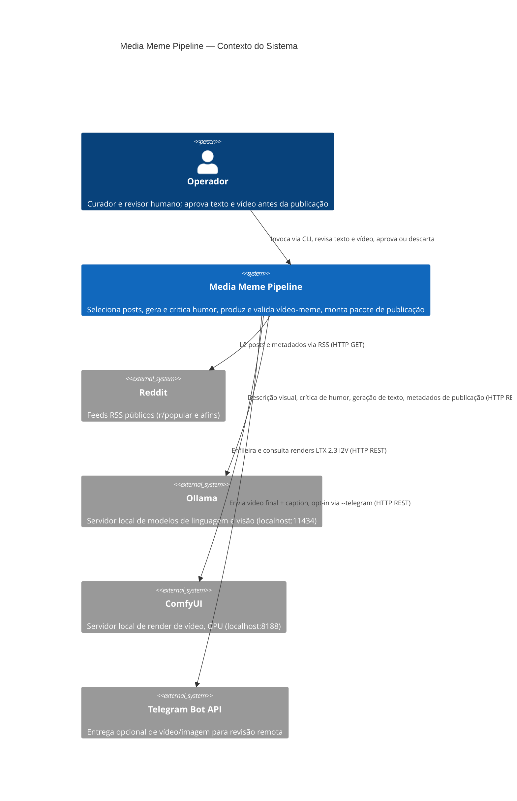
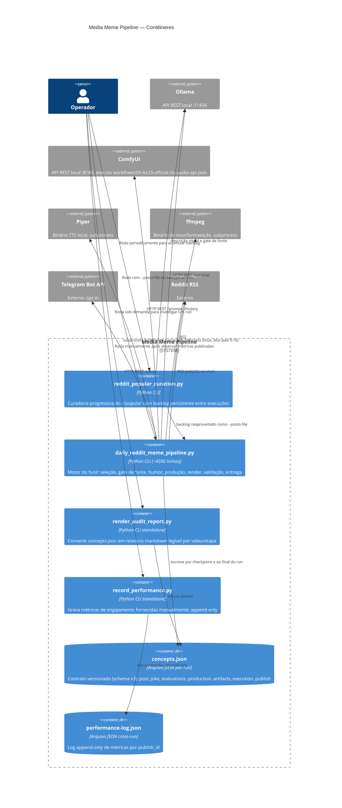
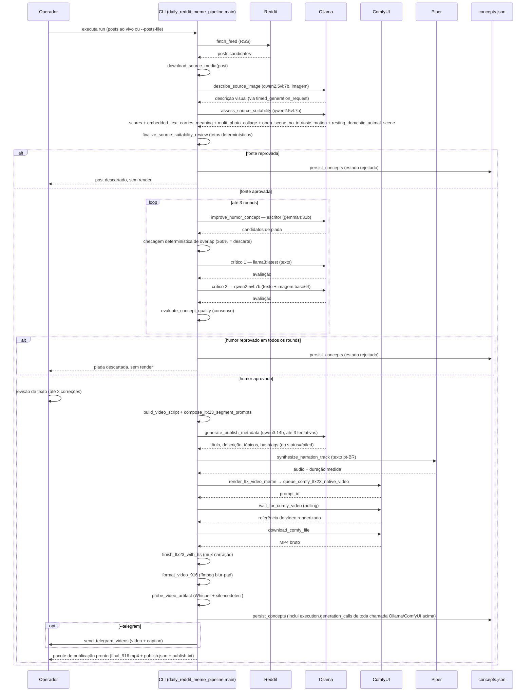

# Media Meme Pipeline — Modelo C4

Este documento descreve a arquitetura do pipeline usando o modelo C4 (Contexto, Contêiner,
Componente/Sequência). É voltado a engenheiros que vão modificar ou operar o sistema, não a
usuários finais.

## Introdução

O sistema transforma posts públicos do Reddit em vídeos-meme curtos e revisáveis. O design
central é um funil adversarial: cada etapa (fonte, humor, texto) tem um gate de rejeição
antes da etapa seguinte, porque o render de vídeo é a operação mais cara do pipeline (minutos
de GPU por tentativa) e a aposta arquitetural é gastar esse custo só depois que a piada já
sobreviveu a crítica automatizada e o texto já foi revisado. O pipeline roda inteiramente
local — modelos de linguagem e visão via Ollama, render de vídeo via ComfyUI/LTX 2.3 numa GPU
local — sem chamada a nenhum serviço de IA hospedado.

## C4 Nível 1 — Diagrama de Contexto

| Relação | O que passa |
|---|---|
| Operador → Pipeline | Linha de comando (`daily_reddit_meme_pipeline.py`, `reddit_popular_curation.py`), decisões de aprovação de texto |
| Pipeline → Reddit | Requisição RSS (`?limit=100`), resposta em Atom/XML com posts, título, mídia |
| Pipeline → Ollama | Prompts de chat (texto e imagem base64), resposta em JSON estruturado |
| Pipeline → ComfyUI | Grafo de workflow parametrizado (`/prompt`), polling de status (`/history`), download do MP4 |
| Pipeline → Telegram | Upload de vídeo/imagem via `sendVideo`/`sendMediaGroup`, opt-in explícito |

## C4 Nível 2 — Diagrama de Contêineres

| Contêiner | Responsabilidade | Tecnologia/protocolo |
|---|---|---|
| `reddit_popular_curation.py` | Curadoria progressiva: aplica o gate de fonte antecipadamente e acumula um backlog aprovado entre execuções | Python, HTTP (RSS + Ollama), checkpoint incremental em JSON |
| `daily_reddit_meme_pipeline.py` | Orquestra o funil completo — do post ao pacote de publicação | Python, HTTP REST (Ollama, ComfyUI, Telegram), subprocess (Piper, ffmpeg) |
| `render_audit_report.py` | Observabilidade pós-facto: transforma o log de auditoria em documento legível | Python, leitura de arquivo, sem rede |
| `record_performance.py` | Captura manual de métricas de engajamento para uso futuro (Fase 3, não implementada) | Python, leitura+escrita de arquivo, sem rede |
| `concepts.json` | Fonte da verdade por run — todo o estado do funil, incluindo o log de auditoria de geração | Arquivo JSON, schema versionado (`CONCEPT_SCHEMA_VERSION`) |
| `performance-log.json` | Histórico de métricas cross-run, chaveado por `publish_id` | Arquivo JSON, lista append-only |
| Ollama | Inferência local de LLM/VLM | HTTP REST, `/api/chat`, payload `{model, messages, options}` |
| ComfyUI | Render de vídeo via grafo LTX 2.3 | HTTP REST, grafo de nós parametrizado, polling assíncrono |
| Piper | Síntese de voz local (narração pt-BR) | Binário CLI via subprocess |
| ffmpeg | Mux de áudio, extração de frame, formatação 9:16 | Binário CLI via subprocess |
| Telegram Bot API | Entrega de revisão remota | HTTP REST, multipart upload |

## Diagrama de Sequência — Caso de uso principal

Fluxo: gerar um vídeo-meme aprovado, do post do Reddit ao pacote de publicação pronto.

## Entidades principais

**`RedditPost`** (dataclass, `reddit_meme_dry_run.py`) — um post candidato.

| Campo | Tipo | Propósito |
|---|---|---|
| `id` | str | Identificador do post no Reddit |
| `title` | str | Título, insumo direto do humor e dos metadados de publicação |
| `subreddit` | str | Origem |
| `media_url` / `media_type` | str | Localização e tipo da mídia-fonte |
| `summary` | str | Corpo/resumo do post |

**Dict "concept"** (estrutura de trabalho em memória, não persistida diretamente) — acumula o
estado de um candidato ao longo do funil: `top_text`/`middle_text`/`bottom_text` (piada),
`video_script` (roteiro semântico), `source_review`/`humor_review`/`quality_review`
(avaliações), `execution` (estado de estágio + `generation_calls`), `publish` (metadados),
`ltx23_segments` (parâmetros de render por segmento).

**`concepts.json`** (documento persistido por run, schema v3) — a fonte da verdade. Cada
entrada da lista corresponde a um concept, com seções fixas:

| Seção | Conteúdo |
|---|---|
| `post` | `RedditPost` serializado |
| `joke` | setup, escalation, punchline, lógica, arquétipo |
| `evaluations` | reviews de fonte, humor, qualidade, rounds |
| `production` | roteiro de vídeo, prompt de imagem, brief de fonte |
| `artifacts` | paths (`*_path`) e metadados técnicos do vídeo (duração, codec, resolução) |
| `execution` | estado do estágio, tentativas, `generation_calls` (log de auditoria — modelo, prompt redigido, parâmetros, timing, preview de resposta, inclusive falhas) |
| `publish` | título, descrição, tópicos de interesse, hashtags, status (approved/failed) |

**`performance-log.json`** (lista append-only, cross-run) — um registro por medição:
`publish_id`, `platform`, `captured_at` (ISO 8601, timezone-aware), `metrics` (dict livre,
ex.: `views`, `likes`, `comments`).

## Modelos usados

| Modelo | Papel | Backend | Motivo da escolha | Parâmetros típicos |
|---|---|---|---|---|
| `qwen2.5vl:7b` | Descrição visual da fonte (`describe_source_image`) | Ollama | Único modelo com visão real nesta configuração; necessário para descrever a imagem sem alucinar | `temperature=0.2` |
| `qwen2.5vl:7b` | Gate de adequação de fonte (`assess_source_suitability`) | Ollama | Mesmo motivo — decide sobre a imagem, não só sobre texto | `temperature=0, seed=20260705, num_predict=250` |
| `gemma4:31b` | Escritor de humor (`improve_humor_concept`) | Ollama | Melhor desempenho observado para geração de piada em pt-BR (~10% de aprovação orgânica histórica) | `temperature=0.85, num_predict=1500` |
| `llama3:latest` | Crítico 1 de humor (texto) | Ollama | Crítica adversarial exige modelo distinto do escritor, para não repetir o viés de geração | `temperature=0.1, num_predict=900` |
| `qwen2.5vl:7b` | Crítico 2 de humor (visão) | Ollama | Segundo crítico independente, com acesso à imagem real — corrige o falso negativo de crítico só-texto | `temperature=0.1, num_predict=900` |
| `qwen3:14b` | Metadados de publicação (`generate_publish_metadata`) | Ollama | `gemma4:31b` (default anterior) deu 0/5 aprovados num experimento controlado (timeout em toda tentativa); `qwen3:14b` deu 5/5 sem retry — ver `docs/roadmap.md` item 22; configurável via `--publish-model` | `temperature=0.4, num_predict=700`, até 3 tentativas |
| LTX 2.3 (distilled LoRA) | Render de vídeo I2V | ComfyUI | Único motor de vídeo local integrado; regime distilled exige CFG=1.0 e sigmas manuais | grafo `workflows/05-ltx23-official-i2v-audio-api.json`, CFG 1.0, base half-res + upscale ×2 + refine 3 steps |

Todas as chamadas a Ollama passam por `timed_generation_request` (`daily_reddit_meme_pipeline.py:1138`),
que grava o payload completo (prompt com imagens redigidas, modelo, `options`) e o resultado
(estado, tempo decorrido, preview de resposta) em `execution.generation_calls` antes de
qualquer validação de schema — inclusive quando a chamada falha.
